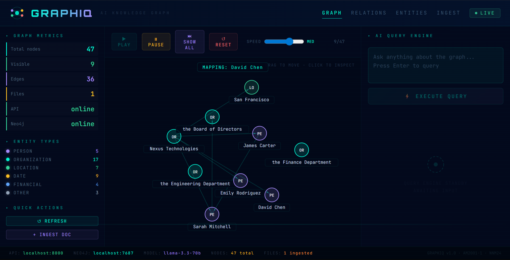
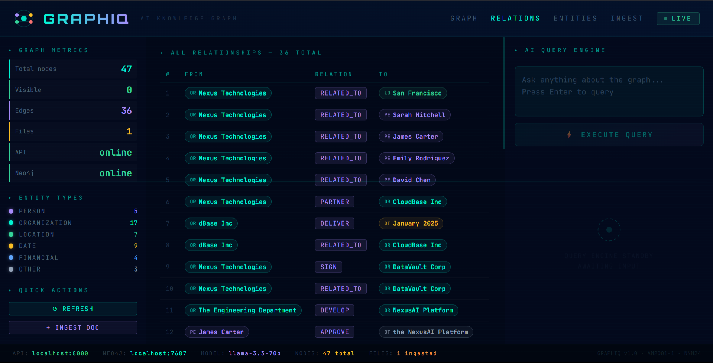
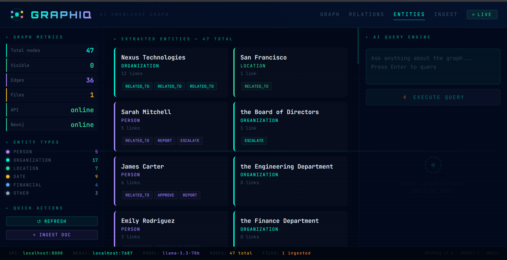
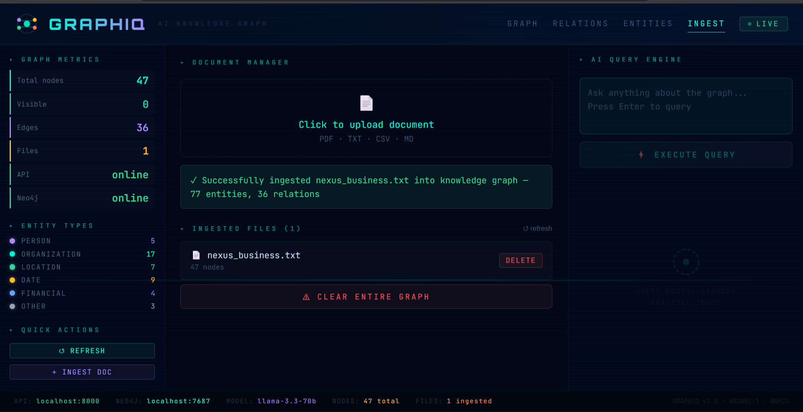

# GraphIQ — AI-Powered Relational Intelligence System

> Turn messy, unstructured documents into a knowledge graph you can actually talk to.


---

## What is GraphIQ?

Ever tried finding a specific piece of information buried across dozens of company documents? You ctrl+F through PDFs, grep through logs, and still come up empty.

GraphIQ was built to fix that.

Drop in your documents — PDFs, text files, reports, whatever — and GraphIQ reads through them, pulls out the important stuff (people, organizations, events, relationships), and builds a live knowledge graph from it all. Then you just ask questions. In plain English. And it actually answers them, with reasoning you can follow.

---

## A quick look at what it does

```
You ask: "Who detected the data breach and what happened next?"

GraphIQ says:
  Priya Nair detected the data breach and reported it to Rahul Sharma.
  Rahul Sharma then hired SecureNet LLC to resolve it.

Here's how it figured that out:
  Priya Nair    → [detected]    → data breach
  Priya Nair    → [reported_to] → Rahul Sharma
  Rahul Sharma  → [hired]       → SecureNet LLC
  SecureNet LLC → [fixed]       → data breach

Confidence: High — all relationships are directly in the graph.
```

It doesn't just give you an answer — it shows its work.

---

## Screenshots

### Graph View — watch the knowledge graph build itself, node by node



The graph animates in real time using a physics-based force simulation. Nodes push and pull against each other, edges form as relationships are discovered. You can drag nodes around, click to inspect them, control the animation speed, and pause at any point.

---

### Relations View — every extracted relationship in one place



A clean table showing all `FROM → RELATION → TO` triples pulled from your documents. Color-coded by entity type so you can spot people, organizations, dates, and locations at a glance.

---

### Entities View — everything the system found, organized by type



Cards for every extracted entity — people, organizations, locations, dates, financial values. Each card shows how many connections it has and what kinds of relationships it's part of.

---

### Ingest View — upload a document and watch the graph update



Drag and drop a PDF, TXT, CSV, or MD file. The system processes it, extracts entities and relationships, and reports back exactly what it found. The graph updates live on the other tab.

---

## How it's all wired together

```
┌─────────────────────────────────────────────────────────┐
│                    PRESENTATION LAYER                    │
│           React 18 + Vite + JetBrains Mono              │
│     Physics Graph · Query Engine · Document Manager      │
└──────────────────────┬──────────────────────────────────┘
                       │ HTTP
┌──────────────────────▼──────────────────────────────────┐
│                      API LAYER                           │
│              FastAPI + Uvicorn + Pydantic                │
│         /query  /graph  /ingest  /delete  /sources       │
└──────────────────────┬──────────────────────────────────┘
                       │
┌──────────────────────▼──────────────────────────────────┐
│                 INTELLIGENCE CORE                        │
│   spaCy en_core_web_trf  ·  Heuristic Relation          │
│   sentence-transformers  ·  FAISS vector index          │
│   Groq llama-3.3-70b     ·  Hybrid retrieval            │
└──────────────────────┬──────────────────────────────────┘
                       │
┌──────────────────────▼──────────────────────────────────┐
│                   STORAGE LAYER                          │
│        Neo4j 5.x Graph DB  ·  FAISS Vector Index        │
│          pdfplumber  ·  PyMuPDF  ·  Text chunking        │
└─────────────────────────────────────────────────────────┘
```

---

## Features at a glance

| Feature | What it does |
|---------|--------------|
| Animated Knowledge Graph | Nodes build up one by one in a physics simulation — pause, rewind, speed up |
| AI Query Engine | Ask anything in plain English, get multi-hop answers with a confidence score |
| Live Document Ingestion | Upload a file and the graph updates on the spot |
| Relations Table | Every extracted relationship in a clean, readable table |
| Entity Explorer | All entities organized by type with their connection counts |
| Document Manager | Upload, view, and delete ingested files |
| NLP Pipeline | Transformer-based Named Entity Recognition via spaCy |
| Vector Search | Node2Vec-style embeddings + FAISS for semantic similarity lookups |

---

## Tech stack

| Layer | Technology | Why it's here |
|-------|-----------|---------------|
| Frontend | React 18 + Vite | Fast, component-based UI |
| Fonts / Theme | JetBrains Mono + Orbitron | Dark, terminal-style aesthetic |
| Backend | FastAPI + Uvicorn | Clean REST API, very fast |
| NLP | spaCy en_core_web_trf | Transformer-based entity recognition |
| Relation Detection | Heuristic + verb extraction | Picks up how entities relate to each other |
| Graph Database | Neo4j 5.x | Stores and queries the knowledge graph |
| Embeddings | sentence-transformers | Converts nodes into semantic vectors |
| Vector Search | FAISS | Fast nearest-neighbor lookups |
| LLM Reasoning | Groq (llama-3.3-70b) | Generates grounded, explainable answers |
| Containers | Docker | Runs Neo4j locally without the setup pain |

---

## Project structure

```
GraphIQ/
├── api/
│   ├── ingestor.py        # Document ingestion + the NLP pipeline
│   ├── main.py            # FastAPI app + all endpoints
│   └── test_pipeline.py   # Pipeline tests
├── data/
│   ├── graphiq_synopsis.txt
│   └── techvision_demo.txt
├── frontend/
│   └── src/
│       ├── App.jsx        # The entire React UI
│       └── main.jsx
├── notebooks/
│   └── GraphIQ_Notebook.ipynb  # Course notebook
├── render.yaml            # Render deployment config
└── requirements.txt       # Python dependencies
```

---

## Getting it running locally

### What you need first

- Python 3.11+
- Node.js 18+
- Docker Desktop (for Neo4j)
- A Groq API key — free at [console.groq.com](https://console.groq.com)

---

### Step 1 — Clone the repo

```bash
git clone https://github.com/manvithh06/GraphIQ.git
cd GraphIQ
```

---

### Step 2 — Set up the Python environment

```bash
python -m venv venv

# Windows
venv\Scripts\activate

# macOS / Linux
source venv/bin/activate

pip install -r requirements.txt
python -m spacy download en_core_web_trf
```

---

### Step 3 — Start Neo4j with Docker

```bash
docker run -d \
  --name neo4j-graphiq \
  -p 7474:7474 -p 7687:7687 \
  -e NEO4J_AUTH=neo4j/password \
  neo4j:5
```

---

### Step 4 — Add your environment variables

Create `api/.env` and paste this in:

```env
NEO4J_URI=bolt://localhost:7687
NEO4J_USER=neo4j
NEO4J_PASSWORD=neo4j_password
GROQ_API_KEY=your_groq_key_here
```

---

### Step 5 — Start the backend

> ⚠️ **Windows note:** If you're on a managed/corporate machine, `uvicorn.exe` might get blocked by Application Control policies. Use the `python -m` approach below — it runs through `python.exe` instead and bypasses the restriction entirely.

```bash
cd api

# Recommended — works everywhere
python -m uvicorn main:app --reload

# Only if your machine allows direct executables
uvicorn main:app --reload
```

---

### Step 6 — Start the frontend

```bash
cd frontend
npm install
npm run dev
```

---

### Step 7 — Open the app

```
http://localhost:5173
```

---

## API reference

| Method | Endpoint | What it does |
|--------|----------|--------------|
| GET | `/` | Basic API info |
| GET | `/health` | Checks Neo4j + API status |
| GET | `/graph` | Returns the full graph as JSON |
| GET | `/sources` | Lists all ingested files |
| POST | `/query` | Runs AI reasoning over the graph |
| POST | `/ingest` | Uploads and processes a document |
| DELETE | `/delete` | Removes all nodes tied to a source file |

---

## How it actually works — step by step

**1. Ingestion**
Your file comes in as a PDF, TXT, CSV, or MD. It gets split into 400-character overlapping chunks so nothing gets cut off at a boundary.

**2. Entity Recognition**
spaCy's transformer model reads each chunk and pulls out named entities — people, organizations, locations, dates, financial values.

**3. Relation Extraction**
The system looks at sentences where two or more entities appear together, finds the root verb connecting them, and extracts a `(subject, relation, object)` triple.

**4. Graph Storage**
Everything gets stored in Neo4j using `MERGE` — so if the same entity shows up across multiple documents, it connects to the same node rather than creating duplicates.

**5. Answering Questions**
When you ask something, the system fetches the relevant part of the graph, builds a context window, and sends it to Groq's Llama model. You get back a grounded, reasoned answer — not a guess.

---

## Things worth asking it

```
Who manages the Engineering Department?
What happened during the security breach?
Trace the path from Priya Nair to SecureNet LLC
What risks does TechVision Inc face?
Summarize all financial decisions in the graph
Which person has the most connections?
```

---

## Course context

| | |
|--|--|
| Course | Advanced Machine Learning (AM2001-1) |
| Institution | NMAM Institute of Technology |
| Project | Mini Project — GraphIQ: AI-Powered Relational Intelligence System |

---

## References

- T. Mitchell, *Machine Learning*. McGraw-Hill, 1997.
- I. Goodfellow, Y. Bengio, A. Courville, *Deep Learning*. MIT Press, 2016.
- A. Hogan et al., "Knowledge Graphs," *ACM Computing Surveys*, vol. 54, no. 4, 2021.
- [Neo4j Documentation](https://neo4j.com/docs/)
- [spaCy Documentation](https://spacy.io/)

---

<p align="center">Built with ❤️ using Python · React · Neo4j · Groq</p>
